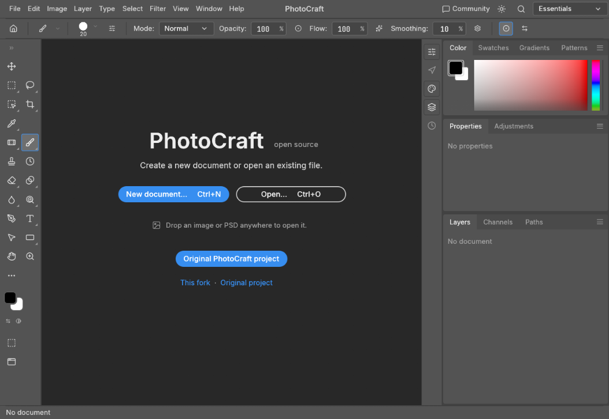

# PixelCraft Studio Community Edition

**Нативный редактор изображений на Rust с поддержкой слоёв и PSD.** Это независимая сборка на основе открытого проекта [`storytold/photocraft`](https://github.com/storytold/photocraft). Репозиторий явно помечен GitHub как форк. Этот проект не официальный и не поддерживается авторами исходного PhotoCraft.

[Исходный PhotoCraft](https://github.com/storytold/photocraft) · [Лицензии и изменения форка](FORK_ATTRIBUTION.md)

**[Открыть браузерный редактор](https://ghostnever-lkm.github.io/pixelcraft-studio/)** · [Исходный репозиторий](https://github.com/storytold/photocraft)



## Что добавлено в этом форке

- Автоматическая сборка WebAssembly-версии и публикация браузерной версии на GitHub Pages при обновлении `main`.
- Русское описание проекта с прямой ссылкой на работающую браузерную сборку и указанием исходного проекта.
- В версии `0.4.0` браузерная сборка сама выбирает первый поддерживаемый язык из предпочтений браузера; язык можно изменить вручную в настройках редактора.
- Из сборки удалены логотипы и графические знаки ArtCraft, которые не входят в MIT/Apache-лицензии кода. Текст исходных условий сохранён для ясности.

Базовый редактор и его инструменты унаследованы от PhotoCraft. Этот форк пока добавляет сборку, распространение и удобство запуска; полный список возможностей и ограничений редактора приведён ниже и в [`docs/roadmap.md`](docs/roadmap.md).

## Возможности редактора

- Слои, группы, маски, режимы наложения, adjustment layers, эффекты слоя, текст и векторные фигуры.
- Открытие и сохранение PSD/PSB, собственный формат `.pcraft`, экспорт PNG, JPEG, TIFF, WebP и других форматов.
- Кисти, выделения, трансформации, фильтры и управление цветом, включая ICC/CMYK-сценарии.
- История изменений, автосохранение и восстановление в настольной сборке.
- Интерфейс на нескольких языках, в том числе на русском; настольное приложение, браузерная сборка и CLI/MCP-инструменты унаследованы от оригинального проекта.

PhotoCraft остаётся ранним проектом и не заменяет проверку готового файла в целевой программе. Смотрите объективный разбор зрелости и пробелов в [оценке паритета](docs/roadmap.md#honest-parity-assessment-2026-10-05).

## Запуск из исходников

Для настольной версии нужны Rust stable и системные зависимости вашей ОС. В корне репозитория:

```sh
cargo run --release -p photocraft
```

Для локальной браузерной сборки нужны target `wasm32-unknown-unknown` и Trunk:

```sh
rustup target add wasm32-unknown-unknown
cargo install trunk --version 0.21.14 --locked
cd apps/photocraft-web
trunk serve --release
```

Подробности сборки, тестов и CLI находятся в [`docs/development.md`](docs/development.md). Веб-версия обрабатывает открытые файлы в браузере и сохраняет результаты через скачивание; этот форк не добавляет облачное хранение.

## ☕ Support / Pro Version

PixelCraft Studio Community остаётся бесплатным проектом с открытым исходным кодом. Отдельная платная Pro-версия ещё не опубликована. Если хотите поддержать автора, отправляйте только активы в соответствующей сети:

| Сеть | Публичный адрес |
| --- | --- |
| TRON (TRC-20) | `TCBSy38X57hA6w2onJcxom24x1febc1mP1` |
| BNB Smart Chain | `0xD431a917961E0b086B96D9F72b5C8fF19b19068a` |
| Bitcoin | `bc1qn75pj4n7gyl2k5kf2f97elyvenz52q6nn2g30u` |

Проверяйте выбранную сеть перед отправкой. Адреса относятся только к указанным сетям; перевод другого актива или по другой сети может быть потерян.

## Происхождение и лицензии

Исходный код взят из [`storytold/photocraft`](https://github.com/storytold/photocraft) на коммите `ec7302f` (8 октября 2026 года). ФотоCraft распространяется на условиях MIT или Apache-2.0; обе лицензии, `NOTICE` и сведения о сторонних ресурсах сохранены. См. [`FORK_ATTRIBUTION.md`](FORK_ATTRIBUTION.md) и [`ATTRIBUTION.md`](ATTRIBUTION.md).

Adobe и Photoshop — товарные знаки Adobe Inc.; проект независим и не связан с Adobe. PhotoCraft — название исходного проекта, от которого происходит этот форк.
